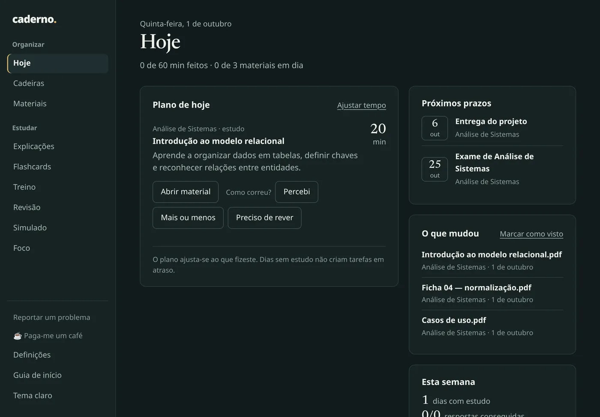
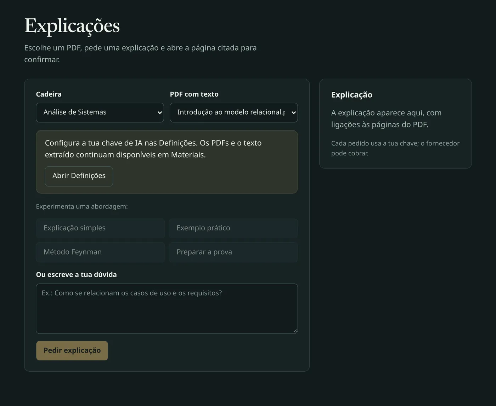
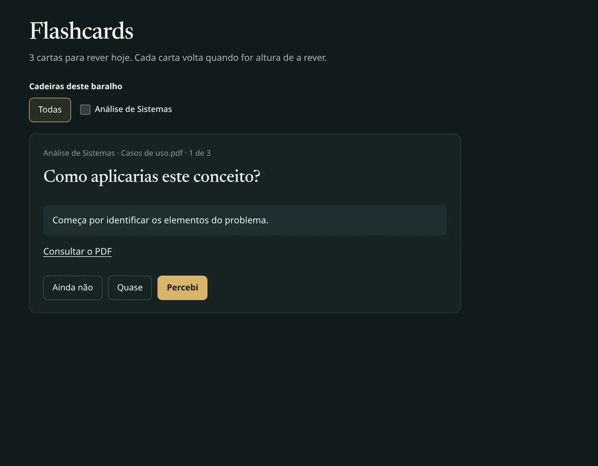
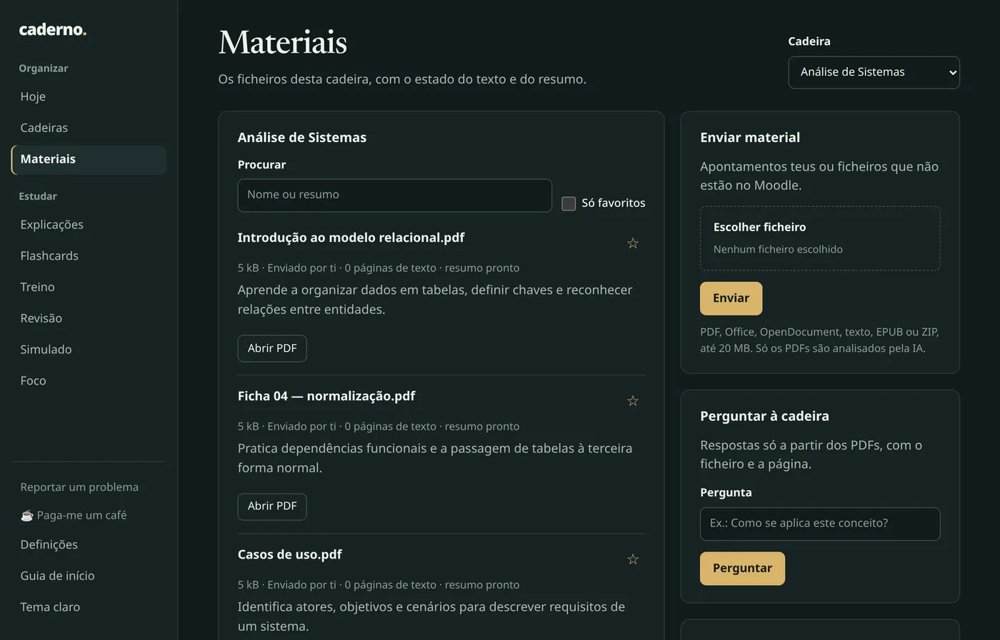
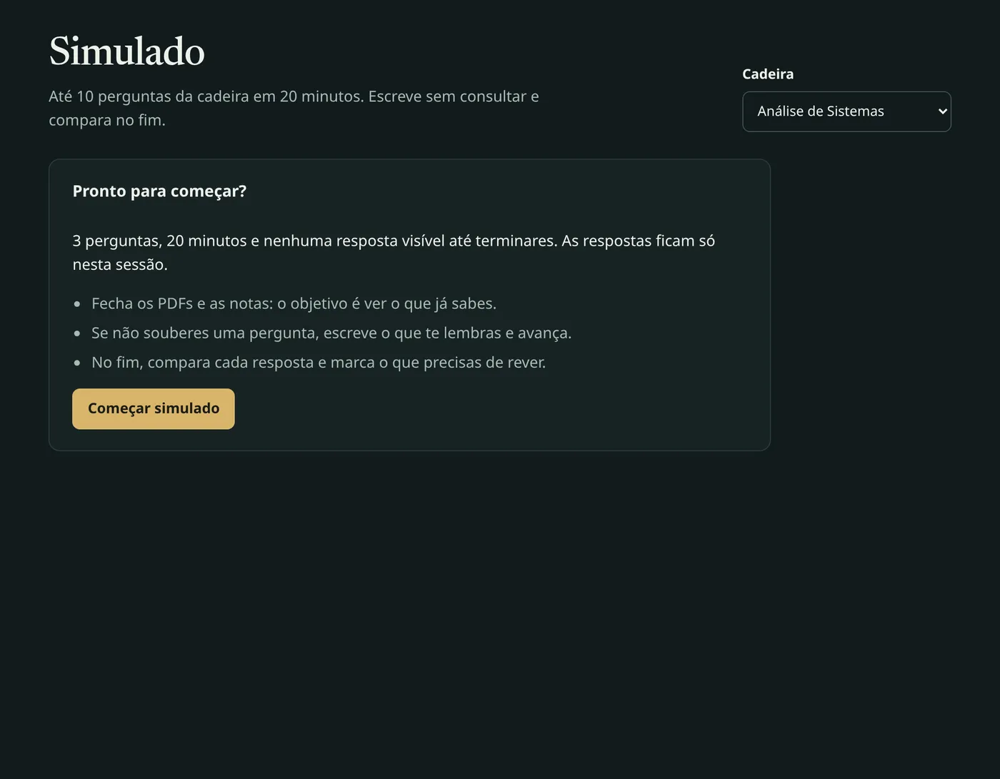

<div align="center">


# Caderno

**Cada cadeira arrumada, o próximo passo à vista.**

Uma aplicação para Windows que junta os materiais e prazos de cada cadeira, monta o plano do dia
e te dá flashcards, treino e simulados. Funciona com o Moodle ou com os teus ficheiros.

[](https://github.com/miguelaopt/caderno/releases/latest)
[](https://github.com/miguelaopt/caderno/actions/workflows/windows.yml)
[](LICENSE)


[**Descarregar**](https://caderno.me/#descarregar) · [Site](https://caderno.me) · [Instalação](docs/DESKTOP.md) · [Reportar um problema](https://github.com/miguelaopt/caderno/issues/new?template=problema.yml) · [Privacidade](https://caderno.me/privacidade)



<sub>Ecrã Hoje, com dados fictícios.</sub>

</div>

## Porquê

O material está espalhado por cadeiras e secções do Moodle, não sabes por onde começar hoje e reler PDFs não fica. O Caderno resolve as três coisas no teu computador:

- **Junta tudo.** Importa ficheiros e prazos do Moodle, ou cria cadeiras e envia os ficheiros à mão.
- **Diz o que estudar hoje.** O plano usa as datas de exame e o tempo que tens em cada dia, e recalcula quando marcas um bloco como estudado.
- **Põe-te a recordar, não a reler.** Flashcards com revisão espaçada, treino, simulados e explicações com ligação às páginas do PDF.

Não há conta nem servidor externo. Os ficheiros, o progresso e as chaves ficam no teu computador. A IA é opcional e usa a tua própria chave, incluindo o plano gratuito da Groq.

## Funcionalidades

| | Precisa de IA? |
|---|:---:|
| **Hoje**: plano do dia, próximos prazos, o que mudou e distribuição até aos exames | Não |
| **Materiais**: pesquisa com ou sem acentos, favoritos, visualizador de PDF offline | Não |
| **Foco**: blocos de tempo associados a um material | Não |
| **Explicações**: perguntas sobre um PDF, com ligações às páginas usadas | Sim |
| **Flashcards**: revisão espaçada com uma ou várias cadeiras | Sim |
| **Treino**: recuperação ativa com autoavaliação | Sim |
| **Folha de revisão**: resumos e conceitos de uma cadeira numa página | Sim |
| **Simulado**: até dez perguntas em 20 minutos | Sim |

<table>
<tr>
<td width="50%"></td>
<td width="50%"></td>
</tr>
<tr>
<td></td>
<td></td>
</tr>
</table>

## Instalar

1. Descarrega `Caderno-<versão>-Windows-x64.exe` em [caderno.me](https://caderno.me/#descarregar) ou nas [releases](https://github.com/miguelaopt/caderno/releases/latest).
2. Abre o instalador. Se o Windows mostrar **«O Windows protegeu o seu PC»**, carrega em **Mais informações** e depois em **Executar mesmo assim** (ver abaixo porquê).
3. Segue o guia de início: cinco passos, cerca de três minutos.

As versões seguintes instalam-se sozinhas: a app procura atualizações ao abrir e de 4 em 4 horas e pergunta antes de reiniciar. Os teus dados não são tocados.

Mais detalhes, cópias de segurança e mudança de computador: [docs/DESKTOP.md](docs/DESKTOP.md).

### Instalador sem assinatura

Ainda não assinado; o código e o build são públicos no GitHub Actions. Cada instalador é compilado a partir deste repositório pelo [workflow Windows desktop](.github/workflows/windows.yml), e as notas de cada release mostram:

- o **SHA-256** do instalador, também num ficheiro `…-SHA256.txt` junto do `.exe`;
- a ligação à execução do GitHub Actions que o compilou;
- a análise no VirusTotal: cada versão é enviada automaticamente quando é publicada.

Para confirmar o ficheiro descarregado, no PowerShell:

```powershell
Get-FileHash .\Caderno-0.3.3-Windows-x64.exe
```

O valor tem de ser igual ao das notas da release (maiúsculas ou minúsculas, tanto faz).

## Primeiros passos

**Moodle.** Em **Cadeiras**, indica o endereço da plataforma (por exemplo `https://moodle.escola.pt`) e entra com o utilizador e a palavra-passe do Moodle. A palavra-passe serve só para obter uma chave de acesso e não é guardada. A sincronização repete-se de 6 em 6 horas enquanto a app está aberta.

> [!IMPORTANT]
> Se entras no Moodle pela página da tua instituição ou com a conta Microsoft ou Google (SSO), usa **Entrar pelo browser**. O Moodle abre no teu browser, entras como de costume e, no fim, o browser pergunta se pode abrir o Caderno. A palavra-passe fica no browser. Isto só funciona se a instituição permitir o login da app móvel oficial pelo browser. Se não permitir, cria as cadeiras à mão em **Cadeira sem Moodle** e envia os ficheiros: o plano, os prazos e a IA funcionam na mesma.

**IA (opcional).** Em **Definições → A tua chave de IA**, escolhe o fornecedor, cria lá uma chave e cola-a. Ao guardar, a app faz um pedido mínimo a cada modelo e explica o erro se a chave, o modelo ou o saldo falharem; o botão **Testar chave** repete esse teste. Depois autoriza a análise em separado.

| Fornecedor | Custo | Protocolo |
|---|---|---|
| Groq | Plano gratuito, sem cartão (limite por minuto) | Chat Completions |
| Anthropic | Pago por uso | Messages API |
| OpenAI | Pago por uso, à parte do ChatGPT Plus | Responses API |
| DeepSeek | Pago por uso, muito barato | Chat Completions |
| Outro compatível | Depende do serviço | Chat Completions, URL HTTPS indicada nas Definições |

Nada é analisado automaticamente: os resumos só são criados quando pedes **Criar resumo com IA** num PDF ou **Analisar PDFs pendentes** em Explicações. Mudar de fornecedor ou de modelos apaga os resumos anteriores, para não misturar resultados.

## Privacidade e dados

| O quê | Onde |
|---|---|
| Materiais | `Documentos\Caderno\Materiais\<perfil>\<cadeira>\` (ou a pasta Documentos do OneDrive, se o Windows a redirecionar) |
| Base de dados, chave local e definições | `%APPDATA%\Caderno\Dados` |

- A chave do Moodle e a chave de IA ficam cifradas com AES-256-GCM e não aparecem na exportação.
- O texto de um PDF só sai do computador quando pedes uma análise, e vai diretamente para o fornecedor de IA que escolheste. PDFs que parecem conter dados de pessoas nunca são enviados.
- A app comunica apenas com o teu Moodle, com o fornecedor de IA escolhido e com o GitHub, para procurar atualizações. Não há telemetria.
- Em **Definições** podes exportar tudo em JSON ou apagar tudo.

Formatos aceites, até 20 MB: PDF, DOCX, PPTX, XLSX, ODT, ODP, ODS, DOC, PPT, XLS, TXT, MD, CSV, RTF, EPUB e ZIP. Só os PDFs têm visualizador integrado e análise por IA; PDFs digitalizados sem texto selecionável ainda não são lidos (OCR está no [roadmap](docs/ROADMAP.md)).

A [política de privacidade](https://caderno.me/privacidade) tem os detalhes.

## Ajuda e contacto

- **Encontraste um problema?** [Abre uma issue](https://github.com/miguelaopt/caderno/issues/new?template=problema.yml) ou, sem conta no GitHub, escreve para [workmfpt@gmail.com](mailto:workmfpt@gmail.com?subject=Caderno). Diz o que estavas a fazer e o que apareceu, sem chaves de IA, palavras-passe ou dados de colegas.
- **Falhas de segurança:** segue o [SECURITY.md](SECURITY.md).
- **Gostas do Caderno?** Dá uma ⭐ ao repositório ou [paga-me um café](https://ko-fi.com/miguelaopt).

---

## Desenvolvimento

Requer Node 24.

```bash
npm ci
npm run desktop:dev   # abre a aplicação Electron a partir do código
```

`npm run serve` abre a mesma interface no browser em `http://localhost:4321`, em modo de desenvolvimento com contas (registo e entrada), útil para testes e capturas. Nesse modo, o endereço do Moodle vem de `MOODLE_URL` no `.env` (ver [.env.example](.env.example)) e os serviços compatíveis adicionais têm de estar em `AI_ALLOWED_BASE_URLS`.

```bash
npm run build       # sintaxe e referências da app e do site
npm run lint
npm run typecheck   # TypeScript em modo checkJs
npm test            # motor antigo, isolamento de contas, perfil local, guia, Moodle e IA simulados
npm run desktop:dist
```

<details>
<summary><strong>Estrutura do projeto</strong></summary>

| Pasta | Conteúdo |
|---|---|
| `desktop/` | Processo principal do Electron: janela, perfil local, atualizações automáticas |
| `scripts/product.mjs` | Servidor HTTP local da app (API e ficheiros) |
| `lib/` | Moodle, sincronização, plano de estudo, IA, base de dados SQLite e segurança |
| `web/` | Interface da app, em JavaScript sem framework |
| `site/` | Site estático [caderno.me](https://caderno.me) |
| `docs/` | Instalação e roadmap |

`scripts/analyze.mjs`, `scripts/sync.mjs` e `npm run legacy:serve` pertencem ao sistema pessoal inicial (`data/estudo.db`, `material/`, `ANTHROPIC_API_KEY`) e não fazem parte da app.

</details>

<details>
<summary><strong>Capturas do site</strong></summary>

As capturas são reais, com dados fictícios: cria uma base temporária com `scripts/seed-screenshot.mjs`, arranca o servidor com `NODE_ENV=desktop` e corre `scripts/capture-screenshots.mjs` (instruções no próprio script). O Chromium do Playwright instala-se com `npx playwright-core install chromium`. Não uses dados de estudantes em material promocional.

</details>

<details>
<summary><strong>Site</strong></summary>

A pasta `site/` é estática (HTML, CSS e um pequeno script) e não precisa de build. Na Vercel, o projeto usa **Root Directory** = `site` e nenhum framework; `site/vercel.json` define URLs limpos e cabeçalhos de segurança. Os botões de download apontam para a última versão conhecida e são atualizados no browser pela API pública do GitHub. As visitas contam-se com o Vercel Web Analytics (`/_vercel/insights/script.js`, sem cookies), que tem de estar ativo no separador **Analytics** do projeto. A fonte dos títulos é a Newsreader (SIL OFL 1.1, em `site/fonts/` e `web/fonts/`).

</details>

### Publicar uma versão

1. Atualiza `version` no `package.json` (por exemplo `0.3.3`) e faz commit.
2. Cria e envia a tag: `git tag v0.3.3 && git push origin main v0.3.3`.
3. O workflow [Windows desktop](.github/workflows/windows.yml) testa, compila numa máquina Windows e cria a release com o instalador, o `latest.yml` das atualizações automáticas e o SHA-256 nas notas. Se o segredo `VT_API_KEY` existir no repositório, envia também o instalador ao VirusTotal e liga a análise nas notas.

Tags com hífen (`v0.4.0-beta`) ficam como pré-lançamento e não chegam às atualizações automáticas. O site passa a oferecer a nova versão sem alterações.

## Participar

Lê o [CONTRIBUTING.md](CONTRIBUTING.md) antes de propor alterações. O trabalho pendente está em [docs/ROADMAP.md](docs/ROADMAP.md).

<sub>Feito por um estudante de Engenharia Informática. Independente, sem afiliação ao Moodle. Código sob a [licença MIT](LICENSE).</sub>
